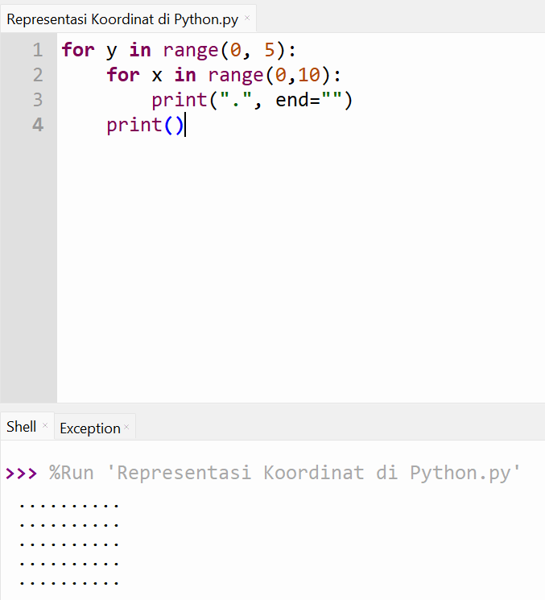

# Pertemuan 3
Project ini berisi latihan Representasi Koordinat di Python pada pertemuan ke-3.
Berikut contoh simulasi koordinat layar (0,0 di kiri atas)
menggunakan code.

Setiap “•” mewakili 1 piksel, ini adalah gambaran
bagaimana komputer “melihat” layar.

# Koding
for y in range(0, 5):
    for x in range(0,10):
        print(".", end="")
    print()

# Hasil Program

