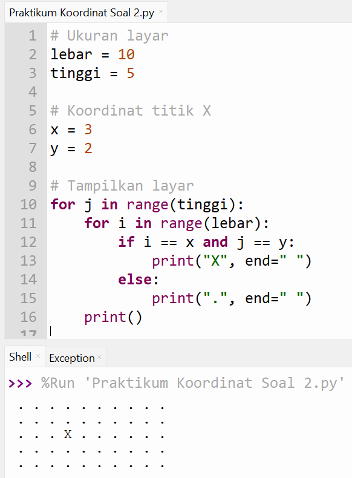

# Pertemuan 3
Project ini berisi latihan Representasi Koordinat di Python pada pertemuan ke-3.
Simulasikan sistem koordinat layar berukuran 10x5 piksel menggunakan simbol ".", dan tampilkan posisi titik (x=3, y=2) dengan
karakter "X".

# Koding
lebar = 10
tinggi = 5

x = 3
y = 2

for j in range(tinggi):
    for i in range(lebar):
        if i == x and j == y:
            print("X", end=" ")
        else:
            print(".", end=" ")
    print()

# Hasil Program

