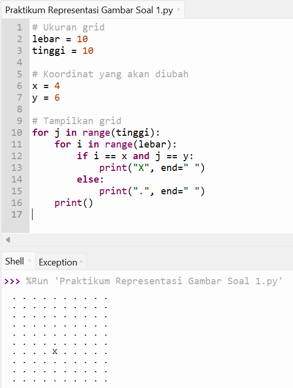

# Pertemuan 3
Project ini berisi latihan Representasi Gambar di Python pada pertemuan ke-3.
Program Python yang menampilkan grid 10×10 piksel menggunakan ".".
Ganti piksel di posisi (4,6) menjadi "X".

# Koding
lebar = 10
tinggi = 10

x = 4
y = 6

for j in range(tinggi):
    for i in range(lebar):
        if i == x and j == y:
            print("X", end=" ")
        else:
            print(".", end=" ")
    print()

# Hasil Program

