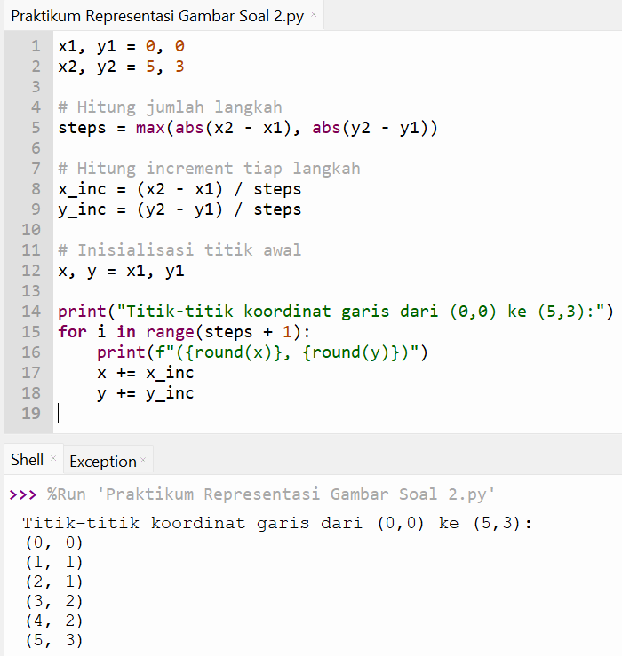

# Pertemuan 3
Project ini berisi latihan Representasi Gambar di Python pada pertemuan ke-3.

Program Python yang menggambar garis dari titik (0,0) ke (5,3) dengan menghitung titik-titik koordinatnya (seperti vektor).

# Koding
x1, y1 = 0, 0
x2, y2 = 5, 3

steps = max(abs(x2 - x1), abs(y2 - y1))

x_inc = (x2 - x1) / steps
y_inc = (y2 - y1) / steps

x, y = x1, y1

print("Titik-titik koordinat garis dari (0,0) ke (5,3):")
for i in range(steps + 1):
    print(f"({round(x)}, {round(y)})")
    x += x_inc
    y += y_inc

# Hasil Program

