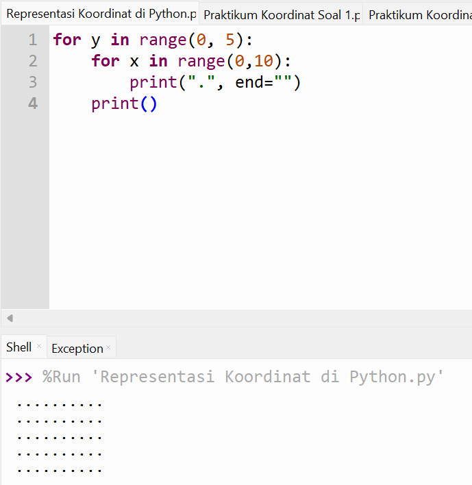

# Pertemuan 3
Project ini berisi latihan pemrograman pada pertemuan ke-3.
# Representasi Koordinat di Python
for y in range(0, 5):
    for x in range(0,10):
        print(".", end="")
    print()
## Hasil Program
Berikut ini hasil output dari program yang telah saya buat:

